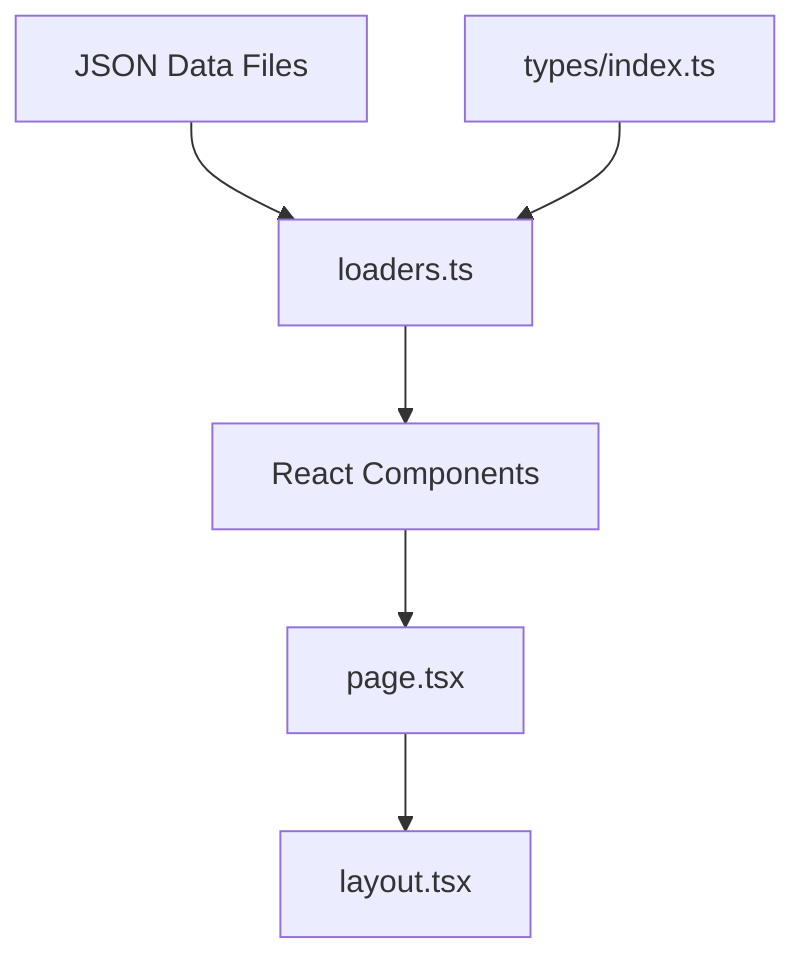
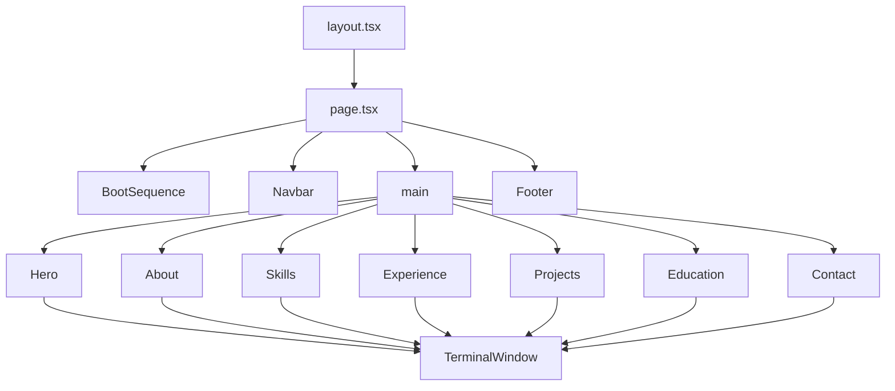

# Architecture Overview

## Tech Stack

- **Framework**: Next.js 15 (App Router)
- **Language**: TypeScript (strict mode)
- **Styling**: Tailwind CSS v4 (configured via `@theme` in `globals.css`)
- **Font**: JetBrains Mono (loaded from Google Fonts)
- **Deployment**: Static export compatible (no server-side features used)

## Project Structure

```
src/
├── app/                    # Next.js App Router
│   ├── layout.tsx          # Root layout (metadata, font, global CSS)
│   ├── page.tsx            # Home page (boot sequence + all sections)
│   ├── globals.css         # Tailwind theme + custom utilities
│   ├── error.tsx           # App-level error boundary
│   ├── not-found.tsx       # 404 page
│   └── loading.tsx         # Loading state
├── components/             # React components
│   ├── ErrorBoundary.tsx   # Client-side error boundary
│   ├── BootSequence.tsx    # Animated boot screen
│   ├── Navbar.tsx          # Fixed navigation bar
│   ├── Hero.tsx            # Hero/intro section
│   ├── About.tsx           # About me section
│   ├── Skills.tsx          # Skills grid
│   ├── Experience.tsx      # Work timeline
│   ├── Projects.tsx        # Project cards (expandable)
│   ├── Education.tsx       # Degrees + certifications
│   ├── Contact.tsx         # Contact form + links
│   ├── Footer.tsx          # Footer with social links
│   └── TerminalWindow.tsx  # Reusable terminal chrome wrapper
├── data/
│   ├── json/               # All content as JSON files
│   │   ├── site.config.json
│   │   ├── nav.json
│   │   ├── boot-sequence.json
│   │   ├── hero.json
│   │   ├── about.json
│   │   ├── skills.json
│   │   ├── experience.json
│   │   ├── projects.json
│   │   └── education.json
│   └── loaders.ts          # Typed re-exports of all JSON data
├── types/
│   └── index.ts            # All TypeScript interfaces
└── hooks/
    └── useScrollReveal.ts  # Intersection Observer hook
```

## Data Flow



All portfolio content lives in `src/data/json/`. The `loaders.ts` file imports each JSON file, casts it to the correct TypeScript type, and re-exports it. Components import only from `@/data/loaders`.

## Component Architecture



## Key Concepts

### Terminal Theme
Every content section is wrapped in `TerminalWindow`, which provides:
- macOS-style title bar with traffic light dots
- Animated command typing effect
- Scroll-triggered reveal animation (via `useScrollReveal`)

### Boot Sequence
On first load, `BootSequence` shows a simulated system boot. Once complete, the main content fades in. Users can skip it with the "skip >>" button.

### Server vs Client Components
- **Server components** (no `"use client"`): `Hero`, `Skills`, `Footer`, `layout.tsx`, `not-found.tsx`, `loading.tsx`
- **Client components** (`"use client"`): `page.tsx`, `Navbar`, `BootSequence`, `About`, `Experience`, `Projects`, `Education`, `Contact`, `TerminalWindow`, `ErrorBoundary`, `error.tsx`

Components use `"use client"` when they need React hooks (`useState`, `useEffect`) or browser APIs.
